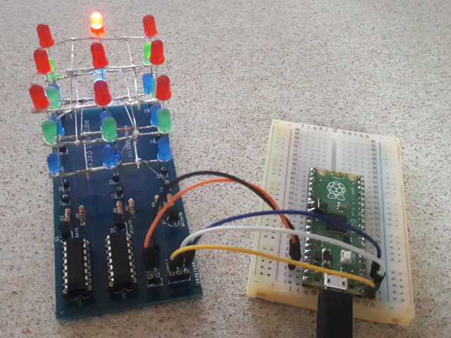

# 3x3x3 LED Cube

A 3x3x3 LED cube with 74HC595N shift registers to set individual LEDs on the different layers and columns. The layers are switched on with BC547B NPN transistors to avoid overloading the GPIO's of the µcontroller. The board should be powered with an external 5V power source.

Contains :
1. Schematic and PCB design files
2. MicroPython module and example code to drive the cube